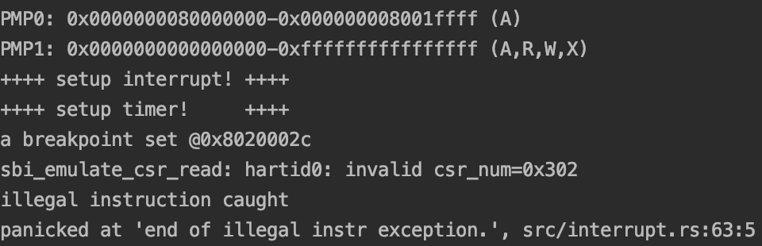

## Lab1 实验报告

2017012289 李岱轩

### 1 rcore中处理中断异常的流程

**Step1 中断异常的产生**：指令发生错误（异常），通过代码跳转到处理函数（陷入），外部信号诱发（外部中断）；

**Step2 硬件操作**： 检查对应的中断使能位是否打开，如果没有打开则不产生中断；如果打开则进行如下操作：

* 在sepc中记录中断产生的地址；
* 在scause中记录中断产生的原因；
* 在stval中记录中断处理的辅助信息，如访存发生问题的目标地址；
* 根据中断时是U态还是S态，sscratch 保存的是内核栈地址或者0；
* 根据stvec的模式和异常处理基址，MODE = 0时直接跳转到基址，MODE=1时跳转到pc←BASE+4×cause。

**Step3 软件操作（OS操作）**：如果stves处于Direct模式（本OS的实现），则跳转到统一的处理程序，此时先**保存现场**，即对所有寄存器在栈上进行保存，并对sscratch进行特殊操作使得恢复现场时仍然具有相同的语义。**然后跳转到异常处理程序**，根据scause判定异常的种类，之后跳转到对应的异常处理程序进行处理。最后，如果异常处理程序返回，则**恢复现场**，即恢复所有的寄存器，**将sepc设置为下一条要执行的指令**，然后异常返回即可。

### 2 是否对于任何中断，__alltraps都需要保存所有寄存器？

不需要保存所有的寄存器。例如，零号寄存器不需要保存，因为x0始终是0。对于普通寄存器和中断异常相关的寄存器，只需要保存每一种中断异常中需要修改的对应寄存器即可，其他寄存器可以不进行保存。

### 3 在任意位置触发一条非法指令异常（如：mret），在 `rust_trap` 中捕获并对其进行处理

我的实现方案是在init.rs中，在触发断点中断后插入一条mret内联汇编触发非法地址异常：

```rust
#[no_mangle]
extern "C" fn rust_main() -> ! {
    crate::interrupt::init();
    crate::timer::init();
    unsafe {
        asm!("ebreak"::::"volatile");
    }
    unsafe {
        asm!("mret"
            :
            :
            : "memory"
            : "volatile");
    }
    panic!("end of rust_main");
    loop {}
}
```

之后在interrupt.rs中添加对非法地址异常的捕获，并在跳转的处理函数中print + panic即可。

```rust
pub fn rust_trap(tf: &mut TrapFrame) {
    match tf.scause.cause() {
        Trap::Exception(Exception::Breakpoint) => breakpoint(&mut tf.sepc),
        Trap::Exception(Exception::IllegalInstruction) => illegal_instr(),
        Trap::Interrupt(Interrupt::SupervisorTimer) => super_timer(),
        _ => panic!("undefined trap!")
    }
}
fn illegal_instr() {
    println!("illegal instruction caught");
    panic!("end of illegal instr exception.");
}
```

程序运行结果为：



图片位置：本文件夹下pic_lab1_1

